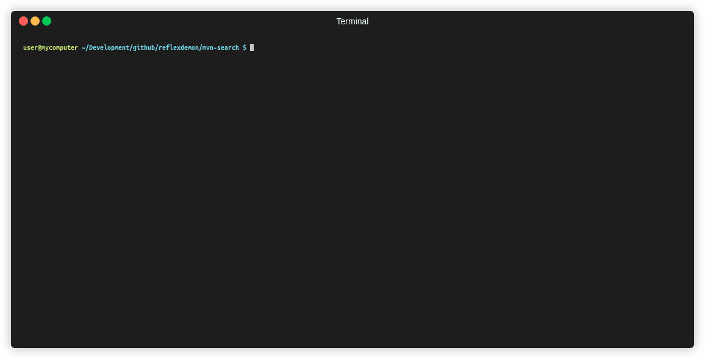

# `jdeps-search` - command-line tool for searching maven central

This is a utility for developers who prefer searching maven dependencies in the command line instead of the web UI of
search.maven.org



## Installation

Prerequisite: node `10.9.0` or newer should be installed.

<!-- Installation:
 - download the latest release from the [releases page](https://github.com/rsrini7/jdeps-search/releases)
 - extract the zip
 - optional: set up the following alias: `alias jdeps-search="node <ZIP-EXTRACTION-DIR>/index.js"`
  -->

```bash
npm install -g @rsrini7/jdeps-search
```

## Usage: `jdeps-search <query-string>`

This will list the found artifacts with their latest version numbers. After selecting the coordinates the tool displays
the maven `<dependency>` tag to be pasted into the `pom.xml`.

### Examples:

- `jdeps-search hibernate-validator`
- `jdeps-search g:org.slf4j`
